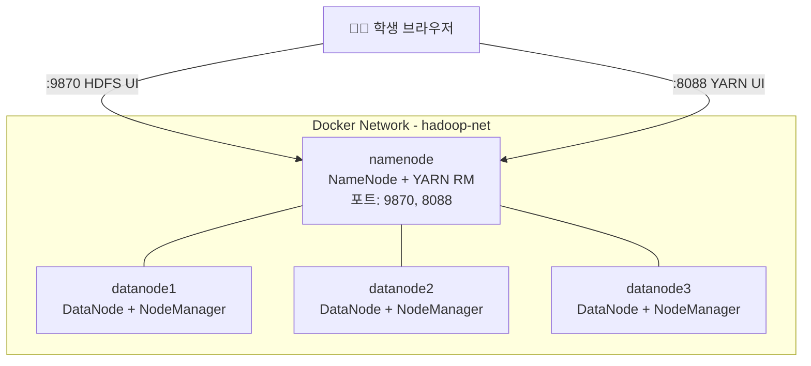

# Hadoop 빅데이터 분산처리 Docker 환경 구축

학생 실습용 Hadoop 분산처리 환경을 Docker로 구성합니다. **NameNode 1개 + DataNode 3개** 구성으로 최소한의 코드로 이해하기 쉽게 작성합니다.

## 전체 아키텍처



## 생성할 파일 목록

| 파일 | 역할 |
|------|------|
| `Dockerfile` | Hadoop 베이스 이미지 빌드 (Java + Hadoop 설치) |
| `docker-compose.yml` | NameNode 1개 + DataNode 3개 오케스트레이션 |
| `config/core-site.xml` | HDFS 기본 설정 (NameNode 주소) |
| `config/hdfs-site.xml` | HDFS 복제 계수, 디렉토리 설정 |
| `config/mapred-site.xml` | MapReduce 실행 프레임워크 설정 (YARN) |
| `config/yarn-site.xml` | YARN ResourceManager 설정 |
| `config/workers` | DataNode 호스트 목록 |
| `scripts/start-namenode.sh` | NameNode 시작 스크립트 (포맷 + 실행) |
| `scripts/start-datanode.sh` | DataNode 시작 스크립트 |
| `README.md` | 학생용 실습 가이드 |

---

## Proposed Changes

### 1. Dockerfile

#### [NEW] [Dockerfile](file:///d:/code/pknu2026/docker/hadoop/Dockerfile)

- **베이스 이미지**: `ubuntu:22.04` (학생들이 익숙한 Ubuntu)
- **설치 항목**: OpenJDK 11, Hadoop 3.3.6, SSH
- **핵심 설계 결정**:
  - Apache 공식 미러에서 Hadoop 바이너리 직접 다운로드
  - 환경변수(`JAVA_HOME`, `HADOOP_HOME`, `PATH`) 설정
  - SSH 키 자동 생성 (패스워드 없이 노드 간 통신)
  - 설정 파일을 `$HADOOP_HOME/etc/hadoop/`에 복사

---

### 2. Hadoop 설정 파일들 (config/)

#### [NEW] [core-site.xml](file:///d:/code/pknu2026/docker/hadoop/config/core-site.xml)

```xml
<!-- HDFS의 기본 파일시스템 주소를 NameNode로 지정 -->
<property>
    <name>fs.defaultFS</name>
    <value>hdfs://namenode:9000</value>
</property>
```

#### [NEW] [hdfs-site.xml](file:///d:/code/pknu2026/docker/hadoop/config/hdfs-site.xml)

```xml
<!-- 복제 계수: 데이터를 3개 DataNode에 복제 -->
<property>
    <name>dfs.replication</name>
    <value>3</value>
</property>
```

#### [NEW] [mapred-site.xml](file:///d:/code/pknu2026/docker/hadoop/config/mapred-site.xml)

```xml
<!-- MapReduce 작업을 YARN 위에서 실행 -->
<property>
    <name>mapreduce.framework.name</name>
    <value>yarn</value>
</property>
```

#### [NEW] [yarn-site.xml](file:///d:/code/pknu2026/docker/hadoop/config/yarn-site.xml)

```xml
<!-- YARN ResourceManager를 namenode에서 실행 -->
<property>
    <name>yarn.resourcemanager.hostname</name>
    <value>namenode</value>
</property>
```

#### [NEW] [workers](file:///d:/code/pknu2026/docker/hadoop/config/workers)

DataNode 호스트 목록 (datanode1, datanode2, datanode3)

---

### 3. 시작 스크립트 (scripts/)

#### [NEW] [start-namenode.sh](file:///d:/code/pknu2026/docker/hadoop/scripts/start-namenode.sh)

- HDFS 포맷 (최초 1회, 이미 포맷된 경우 스킵)
- NameNode 데몬 시작
- YARN ResourceManager 시작
- `tail -f` 로 컨테이너 유지

#### [NEW] [start-datanode.sh](file:///d:/code/pknu2026/docker/hadoop/scripts/start-datanode.sh)

- DataNode 데몬 시작
- YARN NodeManager 시작
- `tail -f` 로 컨테이너 유지

---

### 4. Docker Compose

#### [NEW] [docker-compose.yml](file:///d:/code/pknu2026/docker/hadoop/docker-compose.yml)

| 서비스 | 역할 | 포트 매핑 |
|--------|------|-----------|
| `namenode` | NameNode + ResourceManager | `9870:9870` (HDFS UI), `8088:8088` (YARN UI), `9000:9000` (HDFS) |
| `datanode1` | DataNode + NodeManager | - |
| `datanode2` | DataNode + NodeManager | - |
| `datanode3` | DataNode + NodeManager | - |

- 공통 네트워크: `hadoop-net` (bridge)
- DataNode는 NameNode 의존성 (`depends_on`)
- Named Volume으로 HDFS 데이터 영속화

---

### 5. 학생용 가이드

#### [NEW] [README.md](file:///d:/code/pknu2026/docker/hadoop/README.md)

- 실행 방법 (`docker-compose up`)
- Web UI 접속 방법
- 기본 HDFS 명령어 실습 예제
- MapReduce WordCount 실습 예제
- 종료 및 정리 방법

---

## 핵심 설계 원칙

> [!IMPORTANT]
> **학생 친화적 설계**: 모든 설정 파일에 한글 주석을 포함하여 각 설정이 왜 필요한지 설명합니다.

> [!TIP]
> **최소 구성**: Hadoop의 핵심 컴포넌트(HDFS + YARN + MapReduce)만 포함하여 불필요한 복잡성을 제거합니다.

## Verification Plan

### Automated Tests
1. `docker-compose build` — 이미지 빌드 성공 확인
2. `docker-compose up -d` — 모든 컨테이너 정상 기동 확인
3. 브라우저로 `http://localhost:9870` (HDFS UI) 접속 확인
4. 브라우저로 `http://localhost:8088` (YARN UI) 접속 확인
5. HDFS 명령어 테스트: `docker exec namenode hdfs dfs -ls /`

### Manual Verification
- DataNode 3개가 HDFS UI의 Datanodes 탭에 모두 표시되는지 확인
- 간단한 파일 업로드/다운로드 테스트
